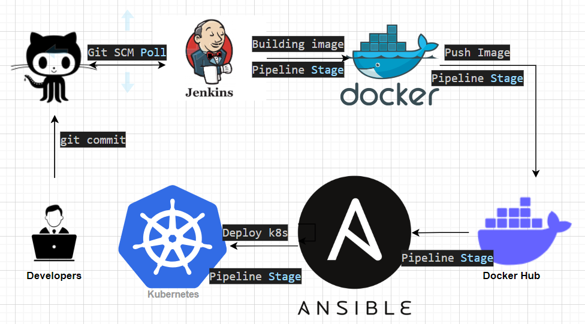
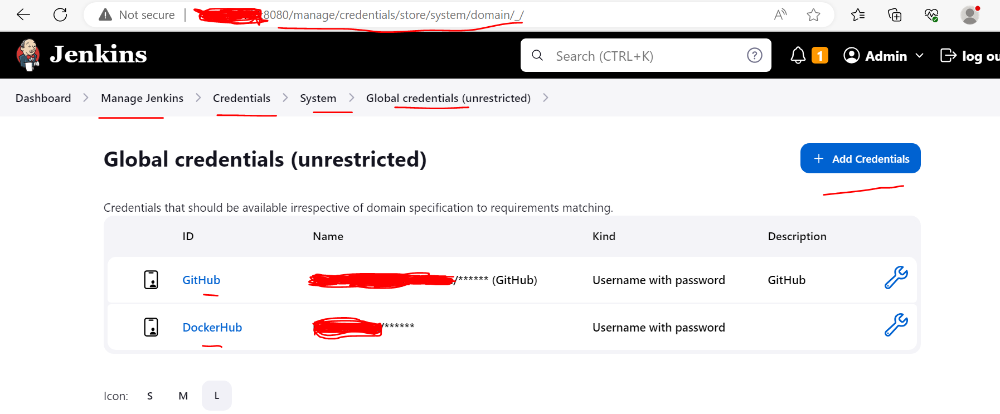
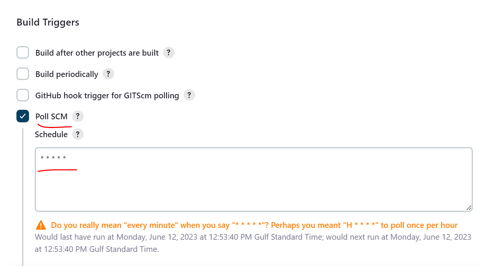
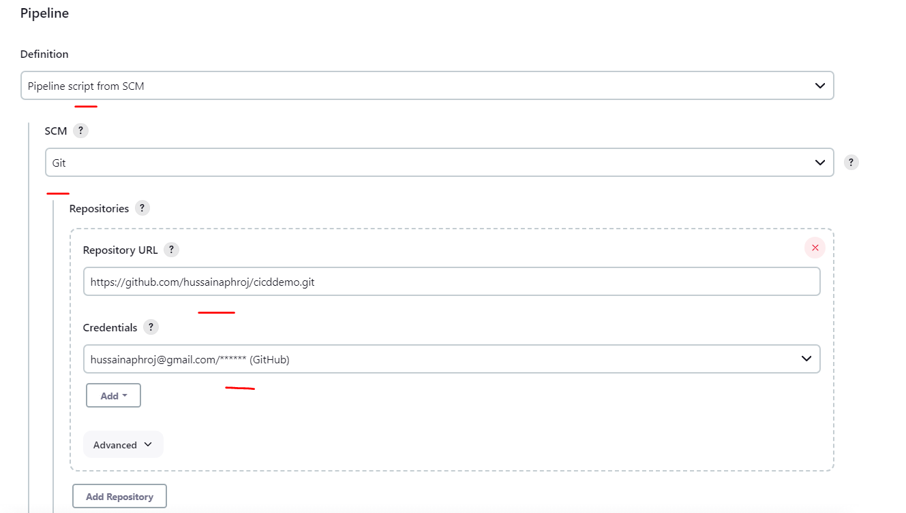
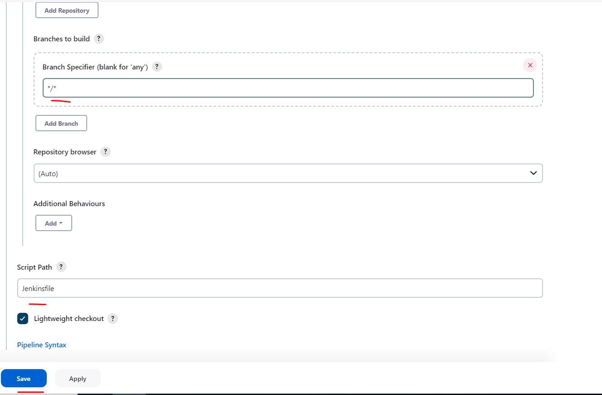
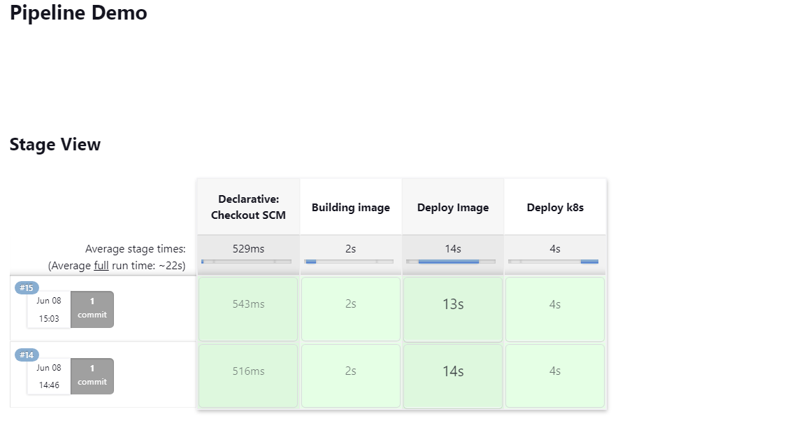
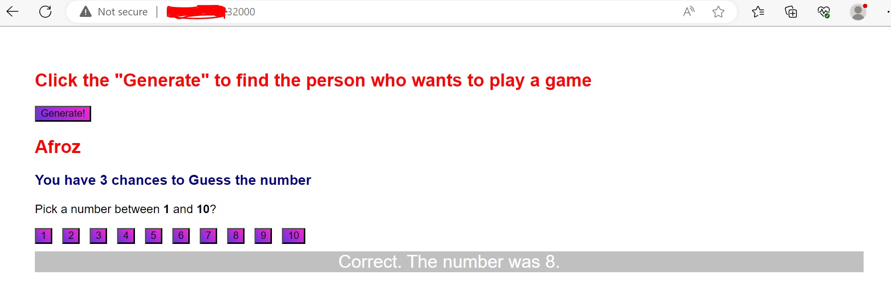

# Streamline Your Software Delivery with CI/CD Using Jenkins, Docker, and Ansible and Kubernetes  

In today's fast-paced software development landscape, delivering high-quality applications quickly and reliably is paramount. Continuous Integration and Continuous Deployment (CI/CD) practices, coupled with powerful automation tools like Jenkins, Docker, and Ansible and Kubernetes, have revolutionized the software delivery process. In this blog post, we will explore how you can leverage these tools to streamline your development pipeline and achieve seamless CI/CD.  

## Understanding CI/CD:
CI/CD stands for Continuous Integration and Continuous Deployment (or Continuous Delivery). It is a set of practices and processes aimed at automating the software development lifecycle to ensure frequent, reliable, and efficient delivery of software changes.

Continuous Integration (CI) involves automatically integrating code changes from multiple developers into a shared repository. This practice helps identify conflicts and integration issues early by triggering automated builds and tests whenever code changes are pushed. CI ensures that the codebase remains in a consistently stable state.

Continuous Deployment (CD) focuses on automating the release and deployment of software changes to various environments, including production. With CD, code changes that pass the automated tests in the CI stage are automatically deployed to the target environment. This process reduces manual errors, enables faster delivery, and ensures that the software is always up to date.

In this demo, we will create a sample HTML application for guessing the number, create a custom Docker image using Dockerfile, Push it DockerHub, and use that image to create deployment`(deploy.yml)`and service`(svc.yml)` definition as `nodeport` and deploy on Kubernetes cluster using Ansible as Jenkins pipeline as shown below in the diagram.
 

The different tools used in this demo are:  
* [GitHub](https://github.com/): GitHub is a web-based platform that provides hosting for software development projects using the Git version control system. It allows developers to collaborate on projects, track code changes, and manage different versions of their software. GitHub provides a wide range of features and tools that facilitate project management, code review, issue tracking, and team collaboration.  
* [Jenkins](https://www.jenkins.io/doc/book/installing/linux/): Jenkins is an open-source automation server that is commonly used for continuous integration and continuous delivery (CI/CD) pipelines in software development. It is designed to automate various tasks involved in building, testing, and deploying software applications. Jenkins provides a vast array of plugins and integrations that enable it to work with different tools and technologies, making it highly flexible and extensible.  
* [Docker](https://docs.docker.com/engine/install/debian/) Docker is an open-source platform that enables developers to build, package, and distribute applications and their dependencies as lightweight and portable containers. Containers are isolated, standalone environments that encapsulate an application and all the necessary software components, such as libraries, runtime, and system tools, needed for the application to run consistently across different computing environments.  
* [Ansible](https://www.ansible.com/overview/how-ansible-works): Ansible is an open-source automation tool that simplifies the management and configuration of systems, applications, and infrastructure. It allows users to define tasks and workflows in a human-readable language, known as YAML, and execute them across multiple machines simultaneously. Ansible is agentless, meaning it does not require any additional software or agents to be installed on the target systems, making it lightweight and easy to set up.  

* [Kuberbetes](https://kubernetes.io/docs/setup/)  Kubernetes is an open-source container orchestration platform that automates the deployment, scaling, and management of containerized applications. It provides a highly scalable and fault-tolerant framework for running and coordinating containers across a cluster of machines.

### Setup the Jenkins
I have used a vm for Jenkins setup and 2 vms where I set up Kubernetes. Kubernetes setup is out of the scope of this demo. You can follow up this tutorial to set up the [Kubernetes](https://github.com/hussainaphroj/kubernetes-cluster-setup).  
#### Install Jenkins, Docker, and Ansible and configure require access to execute our pipeline from the Jenkins server 

* install java
```
sudo apt install default-jre
```
* install Jenkins
```
wget -q -O - https://pkg.jenkins.io/debian-stable/jenkins.io.key |sudo gpg --dearmor -o /usr/share/keyrings/jenkins.gpg

sudo sh -c 'echo deb [signed-by=/usr/share/keyrings/jenkins.gpg] http://pkg.jenkins.io/debian-stable binary/ > /etc/apt/sources.list.d/jenkins.list'

sudo apt update && sudo apt install jenkins

systemctl enable jenkins.service

```
* Install Ansible and openshift module
```
sudo apt update && sudo apt install -y python3 && sudo apt install -y python3-pip

sudo pip3 install ansible && sudo pip3 install openshift

```
* Install Docker
```
for pkg in docker.io docker-doc docker-compose podman-docker containerd runc; do sudo apt-get remove $pkg; done

sudo apt-get install ca-certificates curl gnupg

sudo install -m 0755 -d /etc/apt/keyrings

curl -fsSL https://download.docker.com/linux/ubuntu/gpg | sudo gpg --dearmor -o /etc/apt/keyrings/docker.gpg

sudo chmod a+r /etc/apt/keyrings/docker.gpg

echo   "deb [arch="$(dpkg --print-architecture)" signed-by=/etc/apt/keyrings/docker.gpg] https://download.docker.com/linux/ubuntu "$(. /etc/os-release && echo "$VERSION_CODENAME")" stable" |   sudo tee /etc/apt/sources.list.d/docker.list > /dev/null

sudo apt-get update && sudo apt-get install docker-ce docker-ce-cli containerd.io docker-buildx-plugin docker-compose-plugin

```
* Allow Jenkins user to run docker command
```
sudo usermod -a -G docker jenkins && sudo  systemctl restart docker.service
```

* copy the kubeconfig file to `jenkins` home directoy to deploy the configuration on Kubernetes cluster
```
sudo mkdir /var/lib/jenkins/.kube/ && sudo vi /var/lib/jenkins/.kube/config

chown jenkins:jenkins /var/lib/jenkins/.kube/config
```
That's all with the installation and configuration of the `Jenkins` server. Let's head over to the browser to access Jenkins and install requires plugins and `Pipeline` setup.

* Log in using using ip address as `http://<ip>:8080` .You have to provide the initial password from `/var/lib/jenkins/secrets/initialAdminPassword`. Once you logged in, it will suggest you install require plugins.

* Install `Docker Pipeline` plugins to build docker images and push them to DockerHub.  
Jenkins Dashboard -> Manage Jenkins -> Manage Plugins -> Available Plugins-> Search the `Docker Pipeline` plugins and install them.

* Configure the Jenkins credentials for GitHub and DockerHub  
You can add both credentials(Your GitHub and DockerHub) by accessing this `http://<ip>:8080/manage/credentials/store/system/domain/_/` as shown below
 

* Fork this repository to your Github account to create a pipeline.

* Finally, We create a new Jenkins job of type Pipeline. It will look like this
Jenkins Dashboard -> New Item -> give Name and select Pipeline -> ok  

 
 
  

Before running this pipeline job, you need to change the `registry` and `registryCredential` in `Jenkinsfile` in your git repo. I have used my own DockerHub Registry and its credentials identity that I set in Jenkins credentials.

Now, You are ready to execute this pipeline, you get the Pipeline execution summary as

.

Once the Jobs gets completed, you can access the application using `worker` node ip on port `32000` as shown below
.

That's folk for this demo. Follow my [Github](https://github.com/hussainaphroj) for more content and give me a `star` if you like my work.

Cheers!
Happy Learnings!